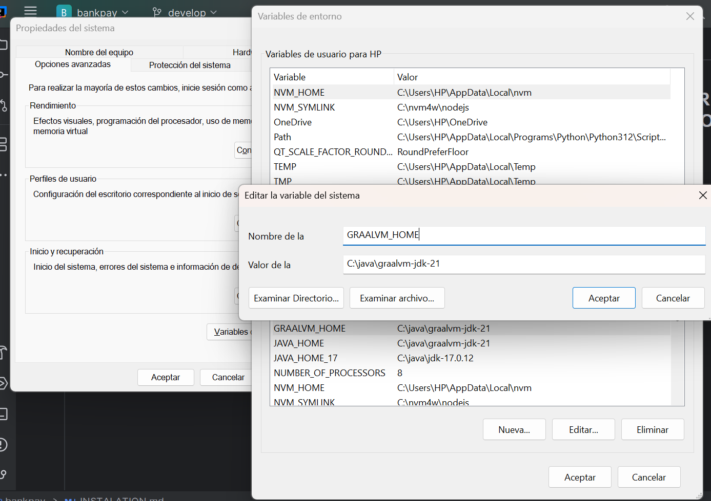
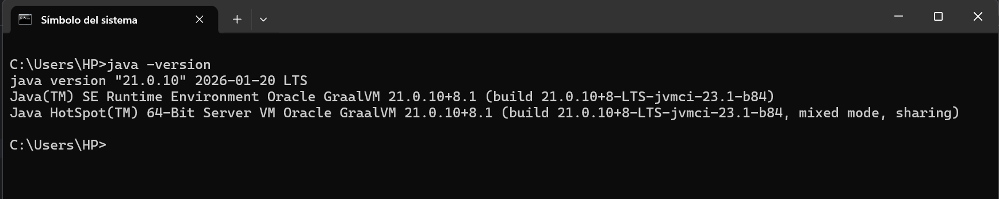
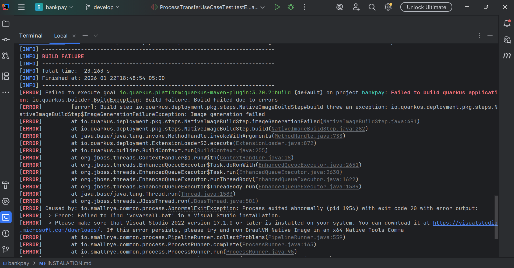
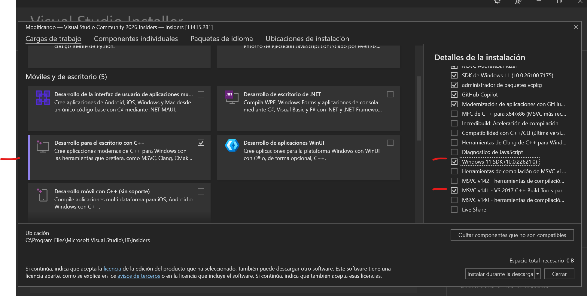
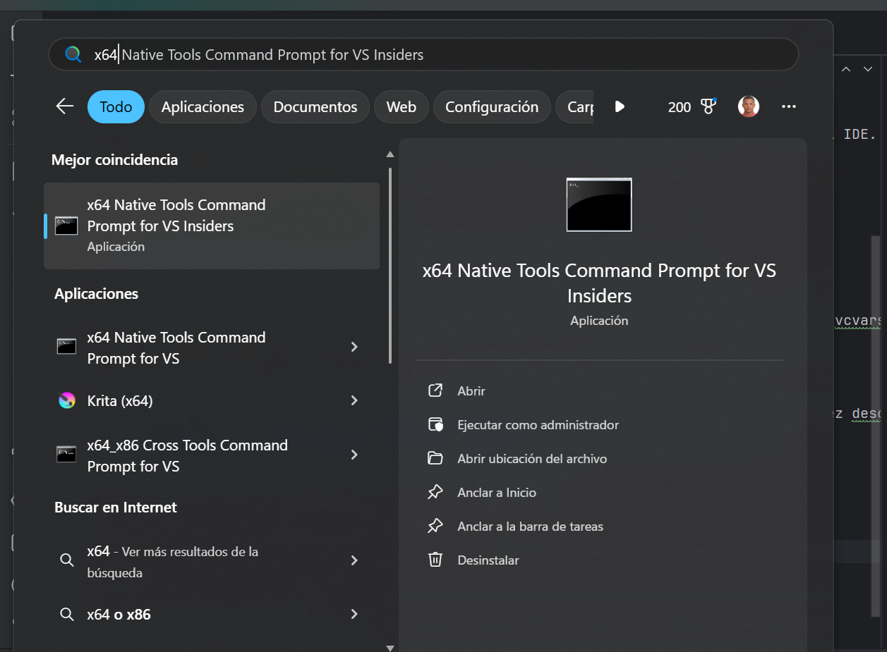
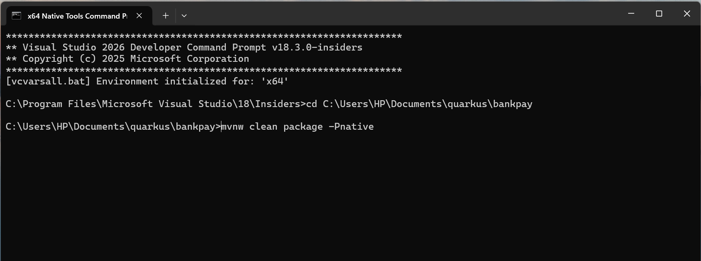

## CREAR IMAGEN NATIVA DEL COMPONENTE

Para generar la imagen nativa del proyecto es necesario tener configurada la variable de entorno GRAALVM en la version 21, [descargar GRAALVM](https://www.graalvm.org/downloads/). 

- Configuracion variable de entorno.



- Confirmamos la configuracion de la variable de entorno




- Para generar la imagen nativa usaremes el comando a continuación en la terminal del IDE.

``` shell script
 ./mvnw clean package -Pnative
```



Como podras observar el siguiente error nos indica que nos hace falta el componente 'vcvarsall.bat'

## Instalar componente 'vcvarsall.bat'

[Descargar Visual Studio 2022](https://visualstudio.microsoft.com/downloads/), una vez descargado y ejecutado debes seleccionar Desarrollo para el escritorio con C++, luego en detalles de instalación seleccionar, Windows 11 SDK (10.0.22621.0), MSVC v141 - VS 2017 C++ build Tools para x64/x86 (v14.16)



## Generar imagen nativa, ¡Ahora si 😄!

En tu barra de tareas abrir la aplicación X64 native tools.


Luego te ubicas en la raiz de tu proyecto que para mi caso es C:\Users\HP\Documents\quarkus\bankpay y finalmente ejecutas el siguiente comando:
``` shell script
 mvnw clean package -Pnative
```


luego buscamos una taza de café (Buen dia 😅) y esperamos que se genera la imagen nativa.


