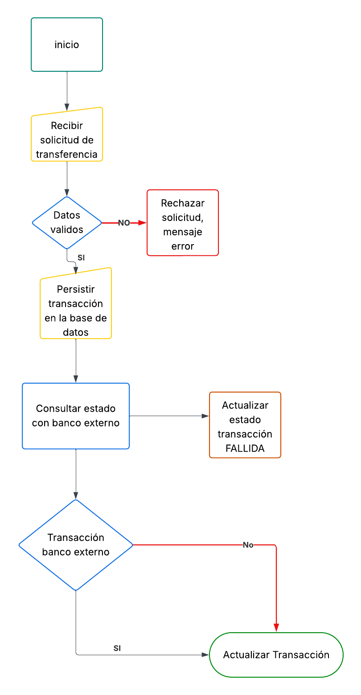

# Proyecto Bancario - Challenge

### Maquina usada para la creación de este proyecto:

```
Apache Maven 3.9.12 (848fbb4bf2d427b72bdb2471c22fced7ebd9a7a1)
Maven home: C:\Users\HP\.m2\wrapper\dists\apache-maven-3.9.12\59fe215c0ad6947fea90184bf7add084544567b927287592651fda3782e0e798
Java version: 21, vendor: Oracle Corporation, runtime: C:\jdk-21
Default locale: es_CO, platform encoding: UTF-8
OS name: "windows 11", version: "10.0", arch: "amd64", family: "windows"
```

## 📑 Tabla de Contenido## 📑 Tabla de Contenido

## 1. Versión
- **IDE:** IntelliJ IDEA 2025.2.5 (Ultimate Edition)
- **Version:** Build #IU-252.28238.7, built on November 19, 2025
- **Quarkus:** 3.30.7
- **Sql Server:** 2022-latest
- **Maven:** 3.9.10
- **Java:** 21
- **Contenedor:** Podman

### 2. Instrucciones de instalación

2.1. Tener configurado la variable de entorno para java (JDK-21).

2.2. Tener instalado una herramienta de contenedores (Docker, Podman), en esta entrega usamos podman.

2.3. Tener clonado el codigo del repositorio e importado en su IDE de preferencia, para esta entrega usamos intellij idea 

2.4 Tener ejecutando el contenedor con el motor sql y una base de datos llamada PagosDB, el ORM se encargará de crear la tabla Transacciones, para crear el contenedor con el motor sql ejecutar en una terminal el siguiente comando:
```shell script
podman run -e "ACCEPT_EULA=Y" -e "SA_PASSWORD=TuPasswordSegura123!"  -p 1433:1433 --name sqlserver-pagos -d mcr.microsoft.com/mssql/server:2022-latestpodman run -e "ACCEPT_EULA=Y" -e "SA_PASSWORD=TuPasswordSegura123!"  -p 1433:1433 --name sqlserver-pagos -d mcr.microsoft.com/mssql/server:2022-latest
```
en caso tal de tener Docker instalado, solo es reemplazar podman por docker.

la imagen usada para el motor de base de datos mcr.microsoft.com/mssql/server:2022-latest, no inicia una base de datos, debemos crear manualmente con un gestor SQl cliente la base de datos llamada PagosDB

2.4. Puedes ejecutar tu aplicación en modo de desarrollo, lo que permite la codificación en vivo, utilizando el siguiente comando:
```shell script
./mvnw quarkus:dev
 ```

## 3. Endpoints

**POST:** localhost:8080/api/v1/transaction/process

**Descripción:** Este endpoint permite realizar una transacción, el primer paso es persistir la trasacción en una tabla SQLServer llamado Transacciones, en estado PENDIENTE, luego consulta a travéz de servicio REST, y finalmente actualiza el estado del registro que previamente persistió.

### Transacción EXITOSA
```
curl --location 'localhost:8080/api/v1/transaction/process' \
--header 'Content-Type: application/json' \
--data '{
    "cuentaOrigen":"00001210030",
    "cuentaDestino":"00000000012233",
    "monto":10000,
    "bancoDestino": "DAVI"
}'

```
### Transacción FALLIDA
```
curl --location 'localhost:8080/api/v1/transaction/process' \
--header 'Content-Type: application/json' \
--data '{
    "cuentaOrigen":"66666652432",
    "cuentaDestino":"9076666524",
    "monto":20,
    "bancoDestino": "BANCO"
}'

```

**Códigos de Respuesta:**

    200 OK - Exitoso: Éxito en la operación.
    500 UNEXPECTED_ERROR: Error interno inesperado del servidor.
## 4. Entregables
- Infraestructura & DevOps
    - Dockerfile multi-stage optimizado.
    - docker-compose.yml para levantar el ecosistema completo localmente.
    - Manifiestos de Kubernetes (deployment.yaml, service.yaml) incluyendo configuración de
      Resources (Limits/Requests)
- Diseño de Performance
  - PERFORMANCE.md

- Documentación
  - Diagrama de flujo de la solución.
    
  - Diagrama de secuencia de la solución.
    
  - MER de la solución

## Author

* **Arnaldo Castilla** - *arnaldo.castilla@gmail.com* 